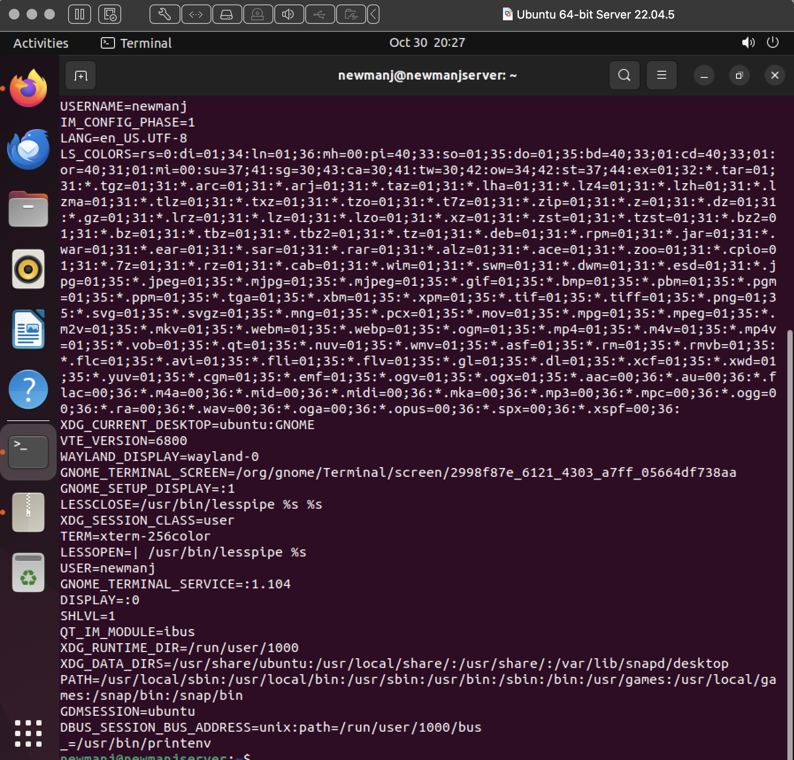
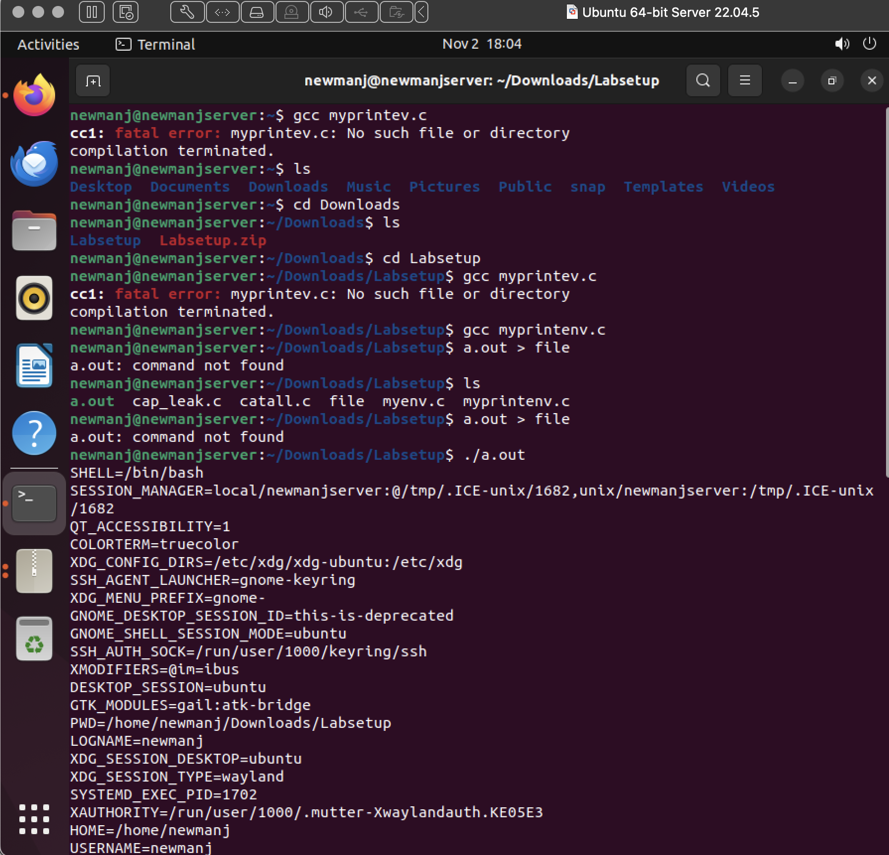
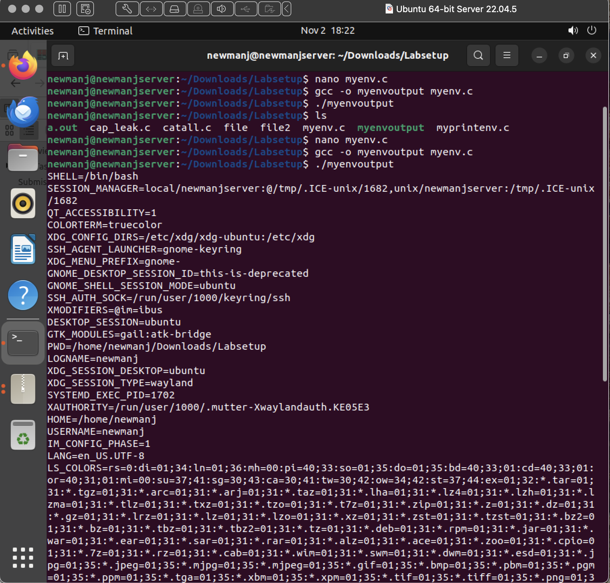
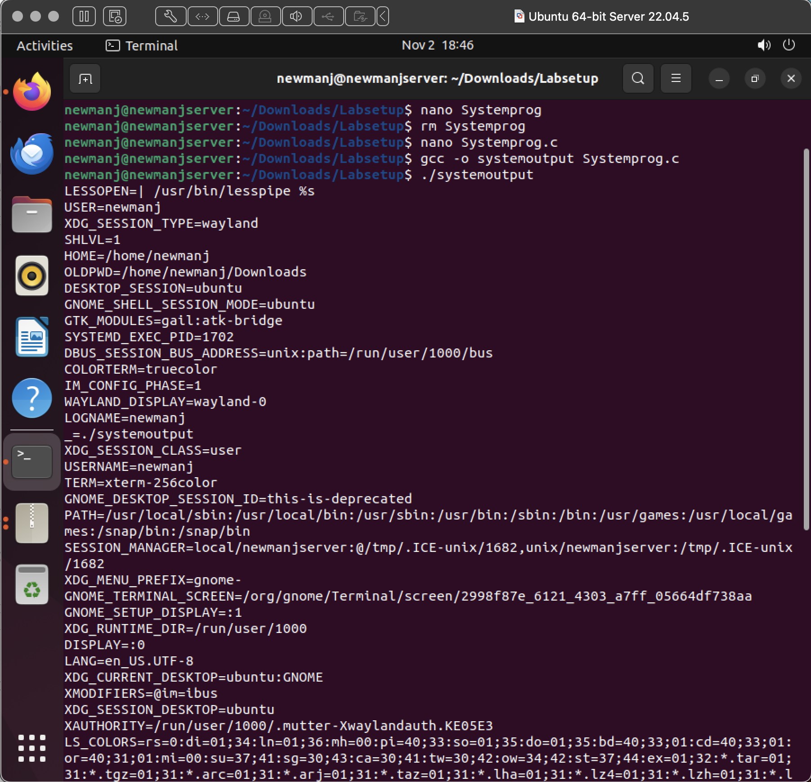
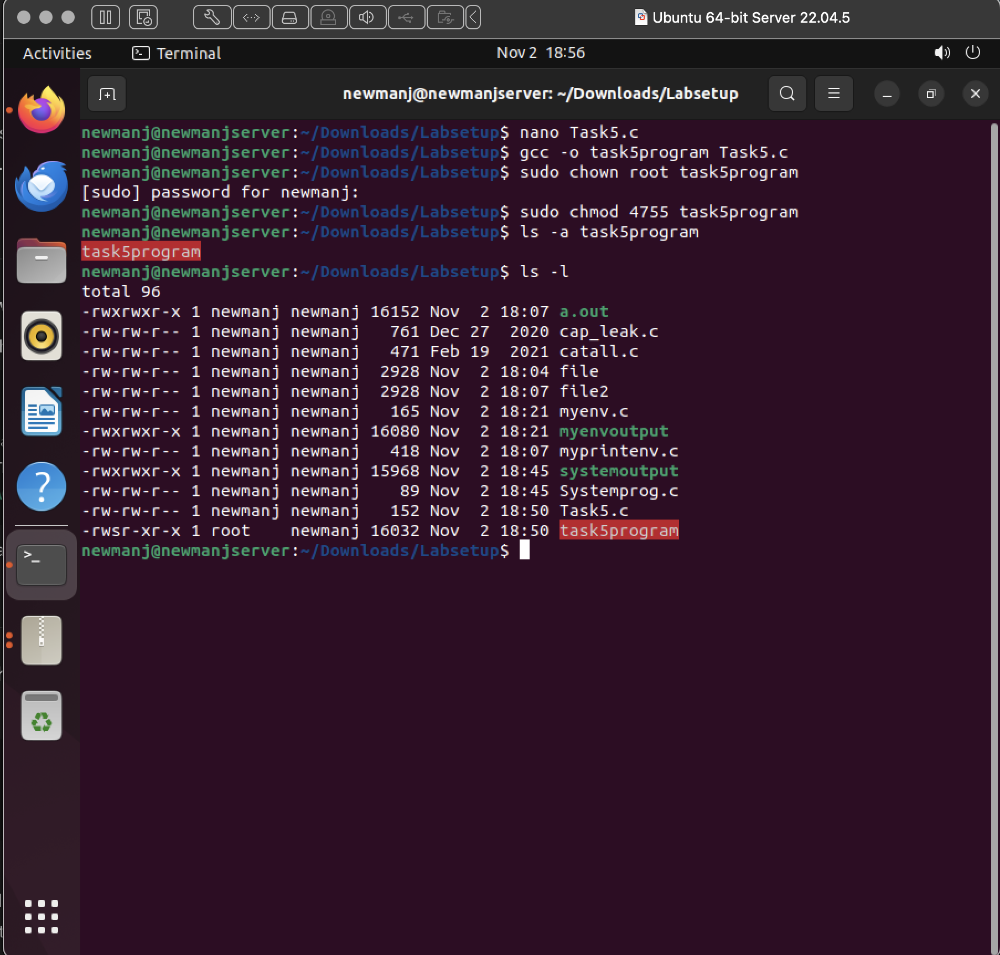
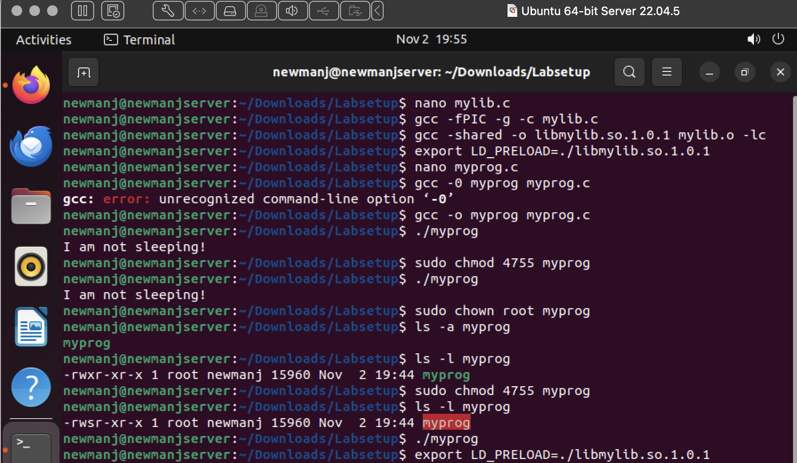
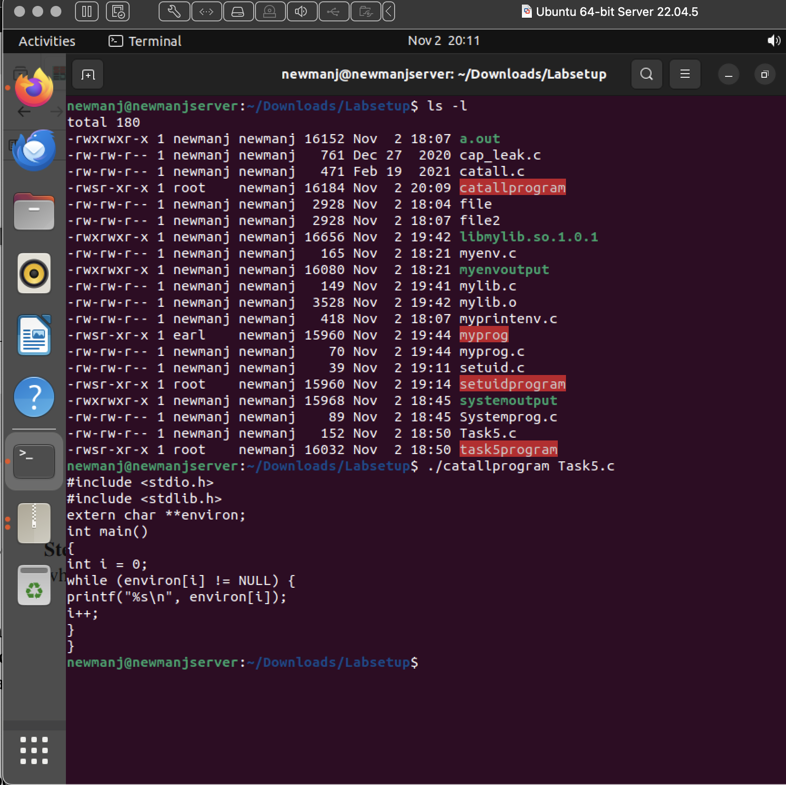
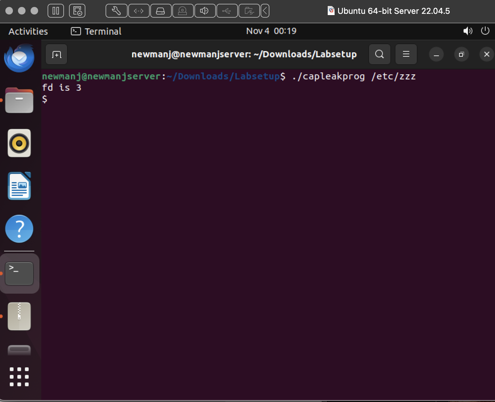

#Basics of Environment Variables and Set-UID Programs

## Task 1:

In th

.png)

## Task 2:

.png)

## Task 3:

## Task 4:

## Task 5:

.png)

.png)

## Task 6:

## Task 7:

.png)

## Task 8:

.png)

## Task 9:

