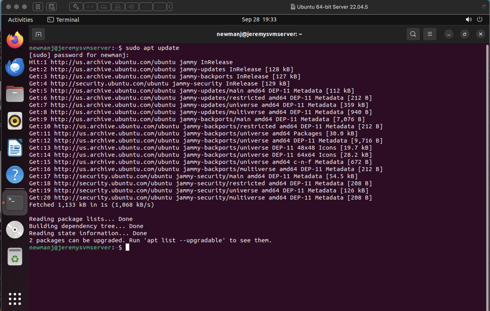
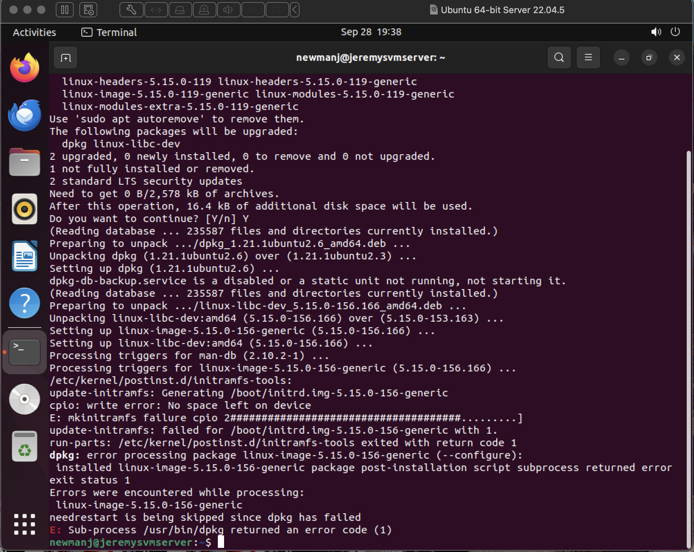
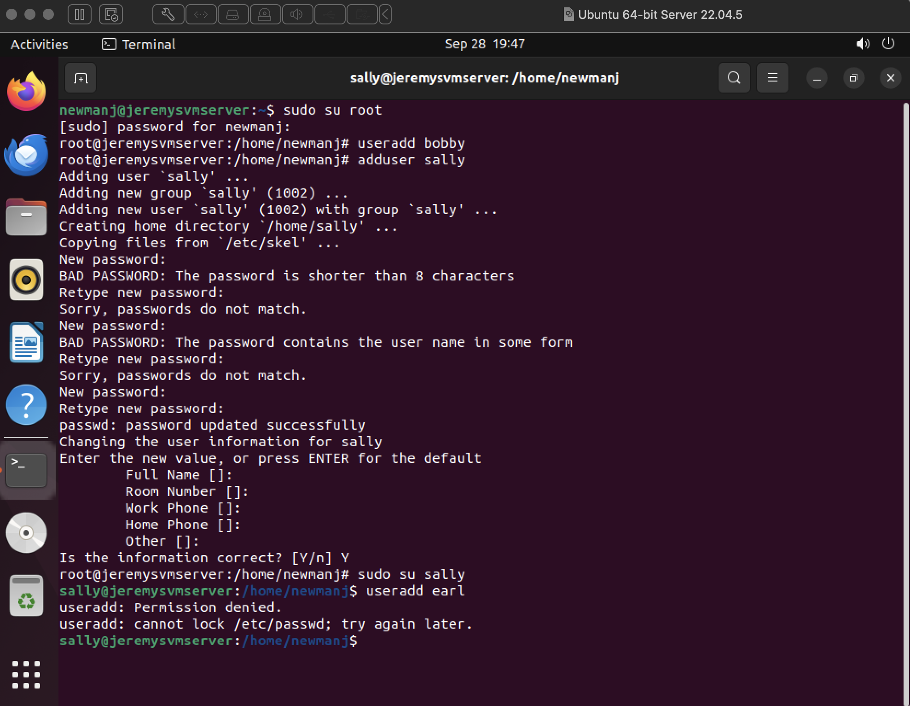
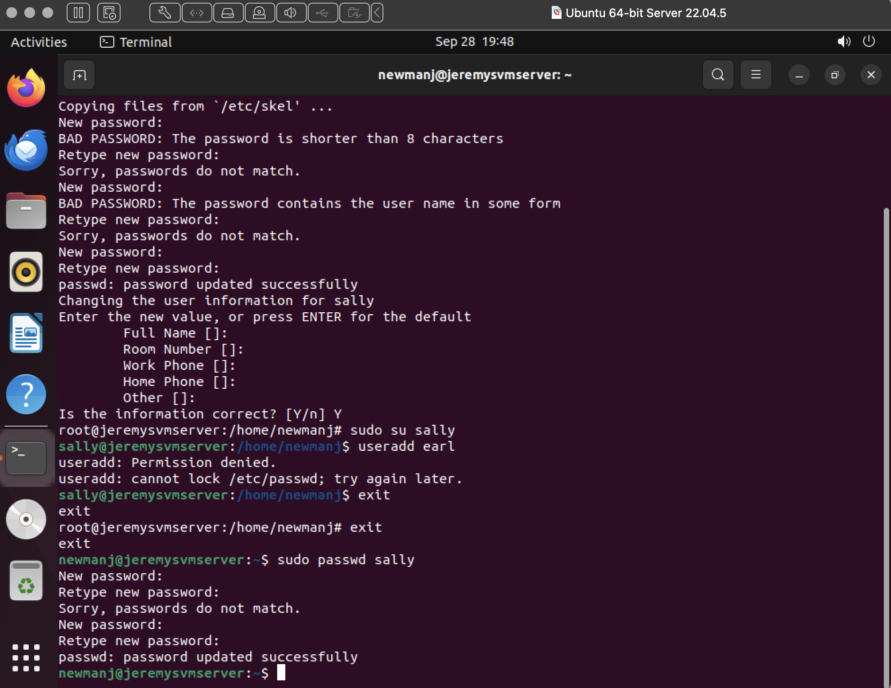
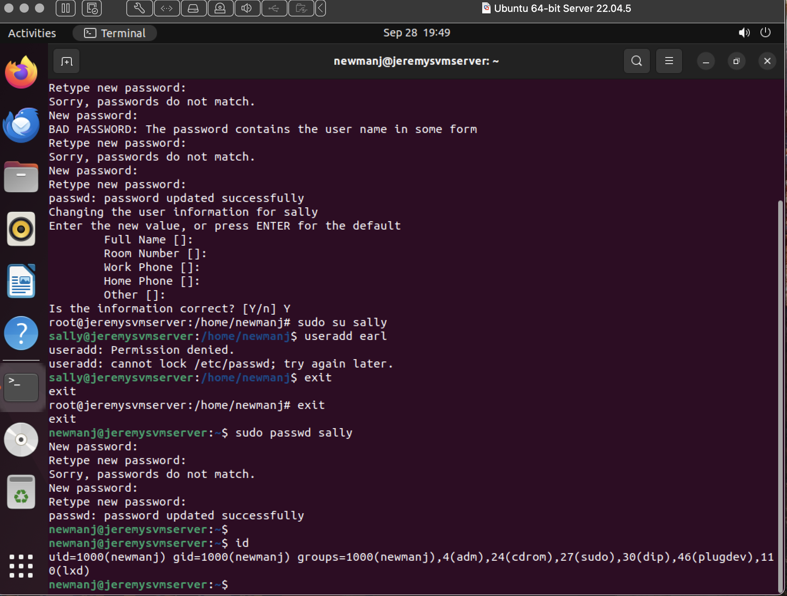
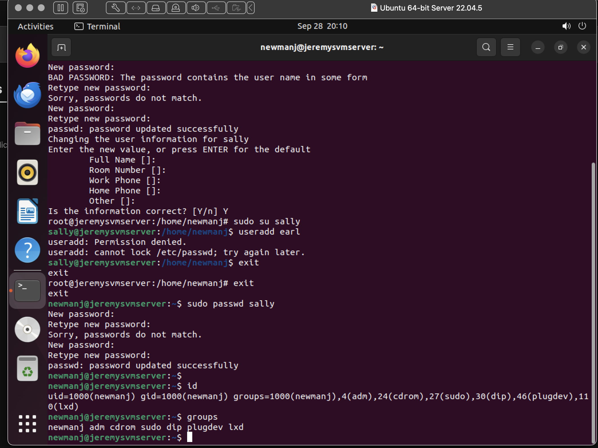
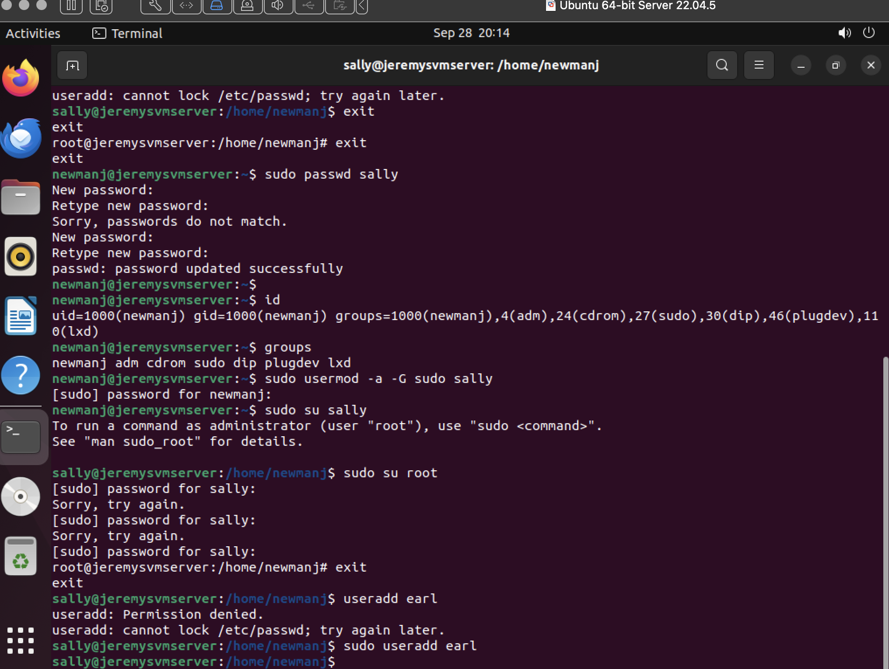
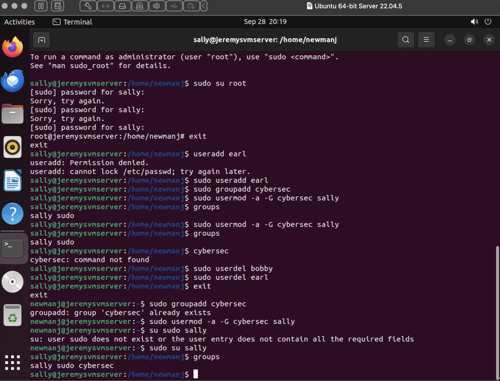

# Introduction to Linux Terminal Commands and Basic Security

## Update and Upgrade of System:

## User Task 1-7:

Once you change from current user to the root user the id in the command terminal changes.
It goes from your user on the server to the root user's address. Useradd asks for no additional
instructions once creating the user. Whilst Adduser allows you to create a password and enter other
user information. Once the user is logged into Sally's account it changes the id in the terminal to Sally's 
id. When you try to create a User from Sally's id the system does not allow it because that user/id does not
have access to those level of commands.

## User Task 9:

I changed the password for Sally's user to something easier to remember but still secure.

## User Task 11:

I used the Id command to see what my User Id consists of.

## Group Task 12:

Ubuntu belongs to 1000(newmanj),4(adm),24(cdrom),27(sudo),30(dip),46(plugdev),0(lxd) groups inside of the server.

## Group Task 13:

By adding Sally to the sudo group on the server, it allows the user to access sudo commands. In which this time when I try to use the useradd command to create the user earl it succeeds. 

## Group Task 14-16:

I exited back to my usual user and created the cybersec group using the sudo groupadd command. Then I added Sally to that group using the sudo usermod -a -G cybersec Sally command. Finally I checked Sally's groups in order to confirm whether the command went through or not. 

## Permission and Access Control Lists:

